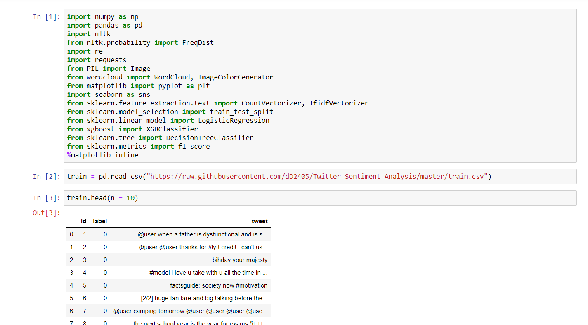
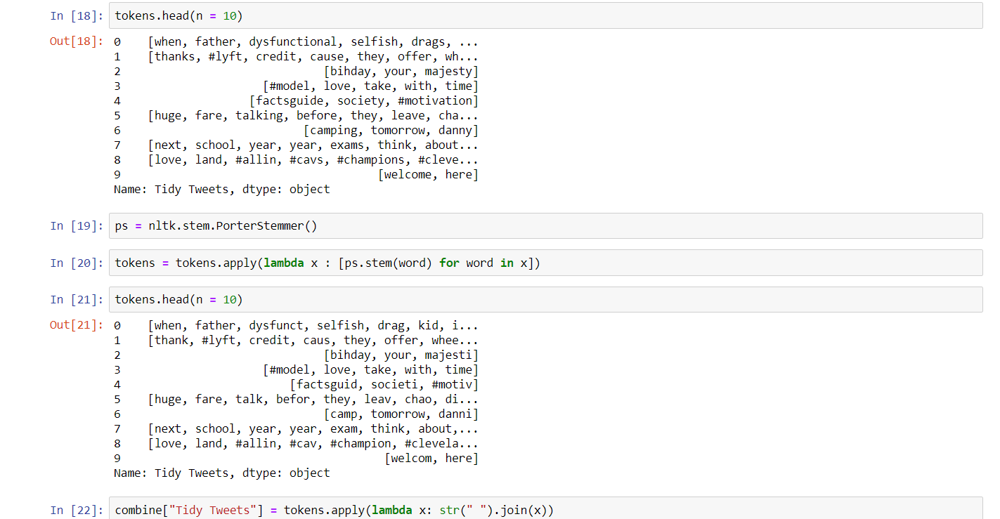
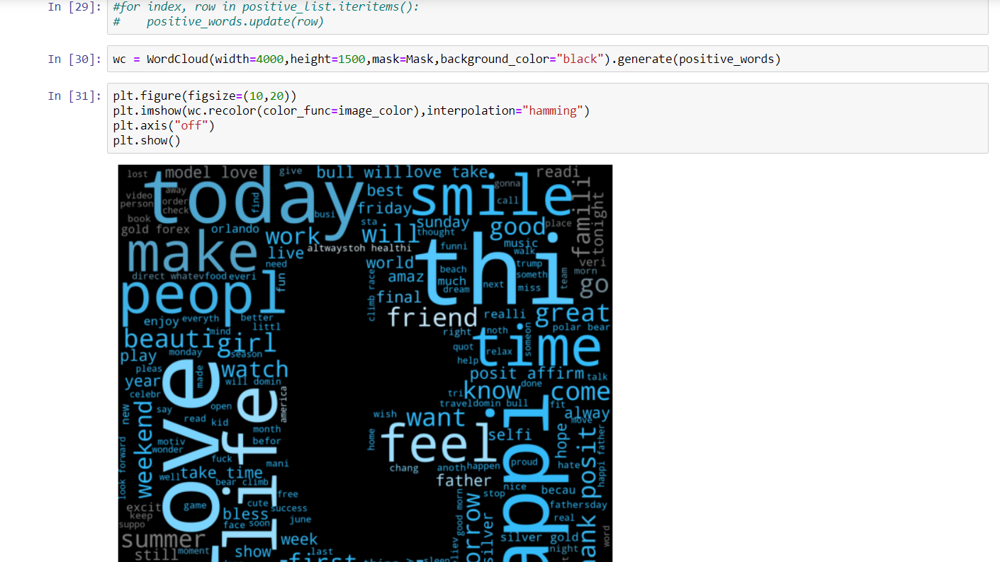
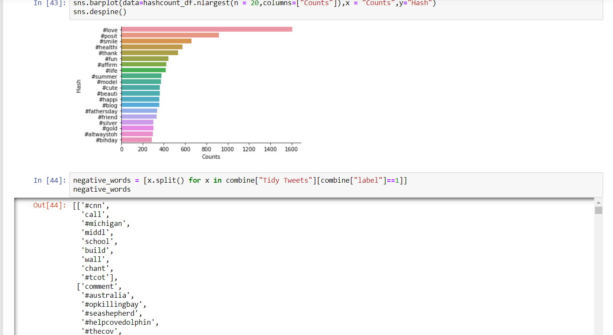

# Twitter-Sentiment-Analysis
Classification of Tweets using machine learning models as being of positive sentiment or negative sentiment. Uses the twitter dataset available in the below link:
https://raw.githubusercontent.com/dD2405/Twitter_Sentiment_Analysis/master/train.csv

The notebook aims to preprocess the twitter data, analyse it and use it to predict the sentiment of the test data

